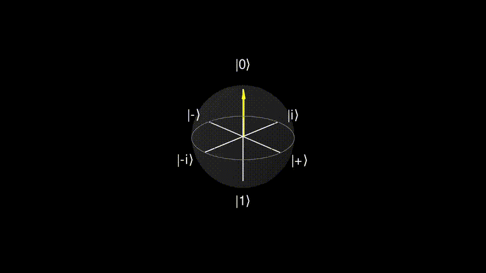

<h1 align="center">QAnimate</h1>

<p align="center">
  
</p>

Manim extension for animating qubit states on bloch sphere, driven directly from a Qiskit's QuantumCircuit

Quantum computing concepts like superposition, rotation gates, and
entanglement are hard to build intuition for from equations alone - I
struggled with it myself. I built this tool because I needed a way to
actually *see* what a gate does to a qubit's state while learning it,
not just read about it.

Goal: `animate(qc)` - automatically generated Manim animations showing how a
qubit's state moves on the Bloch sphere as each gate in the circuit is applied.
## Status: early MVP
### Currently working
- Full 3D Bloch Sphere (BlochSphere3D) using Manim's (Sphere, Circle meridians/equator, Arrow3D state vector).
- Qubit class with animatable state (theta, phi, r via ValueTracker)
- Manual state transitions (q.set_angles(theta, phi))
- Basic entanglement indicator (manual color trigger, not automatic detection)
### Not yet implemented:
- Qiskit bridge
- Multi-qubit entanglement
- Gate labels / circuit diagram
- Multi-qubit circuit layout (multiple spheres side by side, synced timing).

## Setup
```bash
python -m venv .venv
source .venv/bin/activate
pip install manim numpy qiskit pytest
```


## Render a scene

```bash
manim -pql scenes/scene_name.py ClassName
```
(-pql = preview, low quality. Use -pqm/-pqh for medium/high.)

e.g
```bash
manim -pql scenes/bloch_sphere_conversion.py BlochSphereOneQubit
```

Parts of this project were developed with the assistance of AI tools:
- Explaining quantum computing concepts (qubit states, Bloch sphere
  representation, gate rotations) to guide implementation decisions.
- README translation